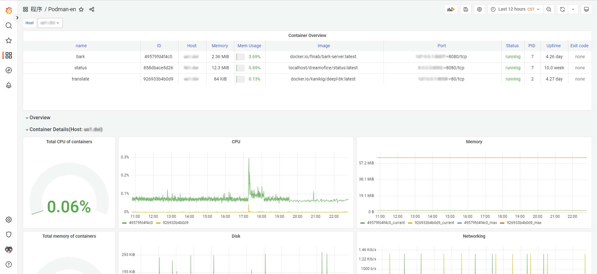

# Grafana Podman Dashboard

A Grafana dashboard for use with `prometheus-podman-export`, available in both Chinese and English.
It allows to visualize information about containers and images

[中文说明](./README_zh_CN.md)

## How to use

1. Install and run [prometheus-podman-exporter](https://github.com/containers/prometheus-podman-exporter).
2. Import the dashboard:

- Use `grafana.com`:
  > Link: [Podman Dashboard EN](https://grafana.com/grafana/dashboards/17639)
  > Dashboard ID: `17639`
- Or import json manually:
  [dashboard-json](./dashboards/en-us.json)

3. Enjoy it!

## License

MIT
