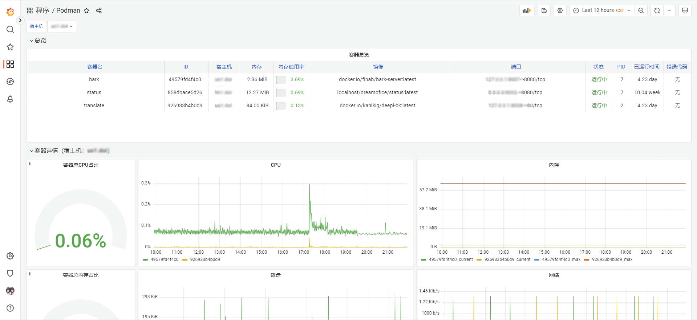

# Grafana Podman Dashboard

通过 Grafana 监控 Podman 容器和镜像运行状态,基于`prometheus-podman-exporter`。

[English](./README.md)

## 食用方法

1. 安装并运行[prometheus-podman-exporter](https://github.com/containers/prometheus-podman-exporter),记得添加参数`-i`以启用镜像信息收集
2. 导入仪表盘:

- 使用`grafana.com`:
  > Link: [Podman Dashboard 中文版(CN)](https://grafana.com/grafana/dashboards/17638)
  > Dashboard ID: `17638`
- 或者手动导入 json 文件:
  [dashboard-json](./dashboards/zh-cn.json)

3. 打开仪表盘看看吧ヾ(≧▽≦\*)o

## License

MIT
